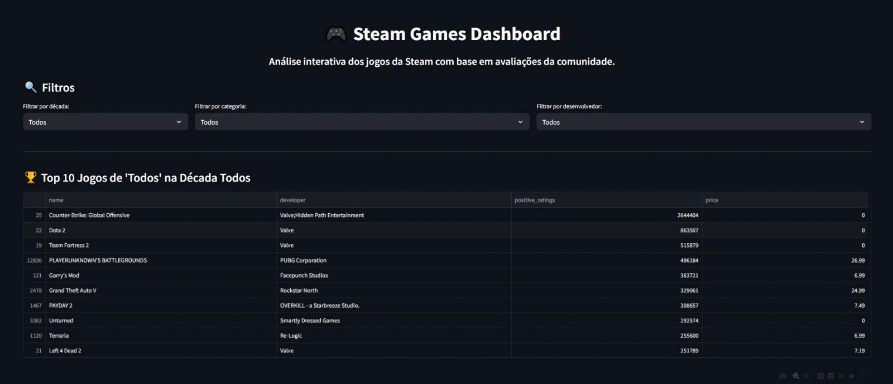

# Steam Game Recommender Dashboard


**Steam Game Recommender Dashboard** é uma aplicação interativa desenvolvida com **Streamlit** para análise e recomendação de jogos da Steam. Utilizando dados do **Kaggle** e visualizações interativas com **Plotly** e **Pandas**, o sistema permite explorar as avaliações de jogos e realizar recomendações personalizadas com base em dados coletados.



---

## ✨ Features

- **Dashboard interativo**: Visualização dos dados de jogos da Steam com filtros e gráficos interativos.
- **Recomendação personalizada**: Geração de recomendações baseadas em avaliações de usuários e outros atributos dos jogos.
- **Análise detalhada**: Permite explorar as relações entre diversas variáveis dos jogos, como gênero, preço, e classificação.
- **Gráficos interativos**: Utiliza **Plotly** para criar gráficos dinâmicos e responsivos para análise de dados em tempo real.

---

## 🖥️ Tecnologias Utilizadas

- **Streamlit**: Framework para criação de aplicativos web interativos.
- **Plotly**: Biblioteca para visualizações interativas.
- **Pandas**: Para manipulação e análise de dados.
- **Scikit-learn**: Algoritmos de recomendação baseados em aprendizado de máquina. (Em desenvolvimento).

## Dados

Os dados foram obtidos no Kaggle.com:
https://www.kaggle.com/datasets/nikdavis/steam-store-games

---

## 📦 Instalação

### Pré-requisitos

1. Certifique-se de ter o Python 3.8 ou superior instalado.
2. Instale as dependências do projeto. (requirements.txt)

### Passos para execução:

1. Clone o repositório:

```bash
git clone https://github.com/gilsonfiho/steam-game-recommender.git
```

---
### 📦Como Rodar

```bash
streamlit run app.py
```
----
## 📊 Como Funciona

O sistema utiliza os dados dos jogos da Steam, incluindo avaliações, gênero, preço e outros atributos, para gerar recomendações personalizadas. O dashboard permite explorar esses dados de forma interativa, com a possibilidade de filtrar, ordenar e visualizar os jogos com base em diferentes critérios.

### Exemplo de Funcionalidades:

1. **Gráfico de Avaliações**: Visualize a distribuição das avaliações dos jogos em diferentes categorias.
2. **Recomendação Personalizada**: Receba sugestões de jogos com base em suas preferências de gênero ou desenvolvedor.
3. **Filtros Interativos**: Filtre os jogos década, categoria e desenvolvedor.
4. **Análise Visual**: Utilize gráficos interativos para entender as tendências de avaliação, gênero e preço dos jogos.

---

### Próximos passos:

Os próximos passos têm como foco a inclusão de dados mais recentes, a adoção do PySpark como alternativa ao Pandas para cenários com grandes volumes de dados e o desenvolvimento de modelos preditivos para identificar tendências de jogos.


---
## 📂 Estrutura do Repositório

```bash
steam-game-recommender/
├── app.py                      # Arquivo principal para execução do Dashboard Streamlit
├── data/                       # Pasta contendo os dados utilizados
│   ├── steam.csv               # Dados de jogos Steam
│   └── steam_cleaned.csv       # Dados limpos após pré-processamento
├── requirements.txt            # Dependências do projeto
├── README.md                   # Este arquivo
└── src/                        # Código-fonte principal
    ├── data-cleaning.py        # Código para limpeza dos dados (Em desenvolvimento).
    ├── feature.py              # Geração de features para recomendação (Em desenvolvimento).
    ├── model.py                # Modelos ML (Em desenvolvimento).
 
```

## Contribuições 💡

1. Fork o repositório
2. Crie uma branch (`git checkout -b feature/nova-funcionalidade`)
3. Commit suas mudanças (`git commit -am 'Adiciona nova funcionalidade'`)
4. Push para a branch (`git push origin feature/nova-funcionalidade`)
5. Abra um Pull Request
